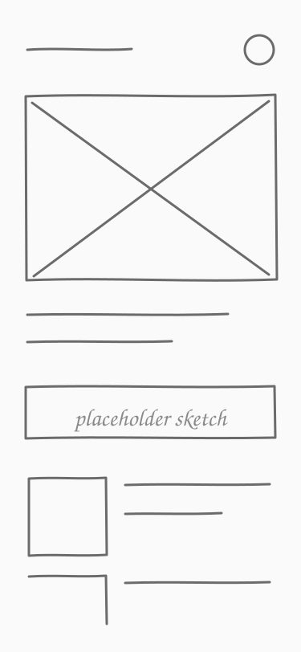
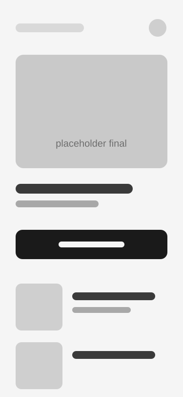

{/*
  This is a draft template: it shows in `npm run dev` and never in production.
  Copy it for each real case study, swap the images and words, then delete it.
  Tip: every headline should state a conclusion, not a topic.
*/}

<Section id="problem" label="The problem" title="Example: finding the right screen took students far too long">

One or two sentences on the problem, who has it, and why it matters. Keep it short — the visuals and insights below do the heavy lifting.

<Insights>
<Insight label="Insight #1" title="Example: most people only use a fraction of the content">
What you learned, in one or two lines.
</Insight>
<Insight label="Insight #2" title="Example: search returned everything at once">
Another finding that shaped the direction.
</Insight>
</Insights>

</Section>

<Section id="research" label="Research" title="Example: talking to users before trusting assumptions">

How you learned about the problem — interviews, surveys, analytics, or testing.

<Stats>
<Stat value={12} label="example: user interviews" />
<Stat value={60} label="example: survey responses" />
<Stat value={3} label="example: key insights" />
</Stats>

<Quote who="Example participant, first interview">
A real quote from someone you spoke to goes here.
</Quote>

</Section>

<Section id="explorations" label="Explorations" title="Example: sketching several directions before choosing one">

Show the early thinking — sketches, wireframes, and the directions you dropped.[^1]

<Figure caption="Early sketch of the home screen.">

</Figure>

<Options>
<Option name="Direction A" verdict="dropped" pros={['Quick to build']} cons={['Didn’t solve the core problem']}>
Why this looked promising, and why you moved on.
</Option>
<Option name="Direction B" verdict="chosen" pros={['Matched how people already search', 'Worked on every screen']} cons={['More engineering effort']}>
Why this won.
</Option>
<Option name="Direction C" verdict="dropped" pros={['Visually striking']} cons={['Too much for new users']}>
Another option you considered.
</Option>
</Options>

</Section>

<Section id="decision-layout" label="Design decisions" title="Example: showing a feature's value in a single glance">

Zoom into one decision that took real thought — spacing, states, motion, or copy — and explain the why.[^2]

<Takeaway title="What changed">
The one-line result of this decision.
</Takeaway>

</Section>

<Section id="final" label="Final" title="Example: the finished screens">

<Figure caption="The final home screen.">

</Figure>

</Section>

<Section id="reflection" label="Reflection" title="Example: what this project taught me">

<Learnings>

- Don't over-engineer a simple problem — lean on patterns people already know.
- Share progress early and often with engineers and stakeholders.
- Prototype in code when a design tool can't show the interaction.

</Learnings>

</Section>

[^1]: Photos of paper sketches work fine here.
[^2]: Margin notes like this are a good place for the reasoning behind a detail.
